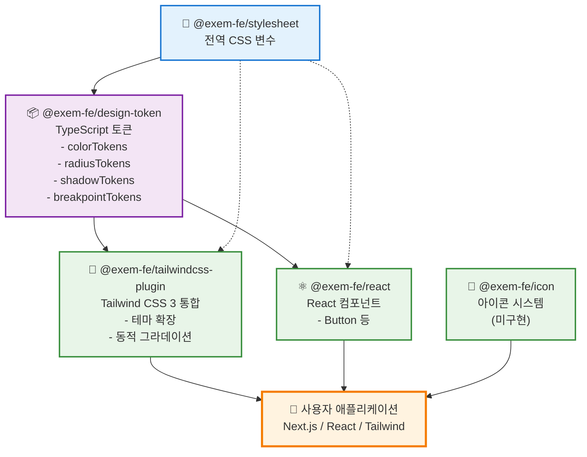

# EXEM Design System

> **v1.0 릴리스 완료** | NPM 배포 완료 | 프로덕션 사용 가능

EXEM 제품군을 위한 통합 디자인 시스템

## 개요

재사용 가능한 UI 컴포넌트와 디자인 규칙을 하나로 모아, 미리 만들어진 표준 요소들을 조합하여 일관된 사용자 경험을 제공합니다.

### 비즈니스 가치

| 항목 | 기대 효과 |
|------|-----------|
| **개발 효율성** | 개발 시간 30-50% 단축, 유지보수 비용 절감 |
| **브랜드 일관성** | 모든 제품에서 통일된 UI/UX |
| **품질 향상** | 검증된 컴포넌트로 버그 감소, 안정성 보장 |
| **협업 개선** | 디자이너-개발자 간 공통 언어, 온보딩 시간 단축 |

**적용 대상**: MaxGauge, InterMax 등 EXEM 제품군

## 현재 상태 (2025년 10월)

**v1.0 릴리스 완료**
- NPM 배포: Design Token, Stylesheet, React Components, Tailwind Plugin
- 자동화 인프라 구축 (CI/CD, 품질 검증)
- 개발자 문서 완료

## 구성 요소

### 배포 완료 (NPM)

- **@exem-fe/design-token** [](https://www.npmjs.com/package/@exem-fe/design-token): 색상, 크기, 간격 등 디자인 규칙
- **@exem-fe/stylesheet** [](https://www.npmjs.com/package/@exem-fe/stylesheet): 전역 CSS 스타일 및 변수
- **@exem-fe/react** [](https://www.npmjs.com/package/@exem-fe/react): UI 컴포넌트
- **@exem-fe/tailwindcss-plugin** [](https://www.npmjs.com/package/@exem-fe/tailwindcss-plugin): Tailwind CSS 통합

### 개발 예정

Icon System, Input, Select, Modal 등 추가 컴포넌트 (2026년)

## 로드맵

### 2025년 (완료)

| 분기 | 주요 목표 |
|------|-----------|
| Q1 | 디자인 토큰 시스템 설계, 빅테크 레퍼런스 조사 |
| Q2 | 컴포넌트 아키텍처 구성, 모노레포 인프라 구축 |
| Q3 | 컴포넌트 개발, 자동화 파이프라인 구축 |
| Q4 | **v1.0 릴리스 및 NPM 배포** |

### 2026년 (계획)

| 분기 | 주요 목표 |
|------|-----------|
| Q1 | 컴포넌트 추가, NPM 안정화 |
| Q2 | EXEM 제품 적용 |
| Q3 | 프로세스 자동화, AI 기반 개발 도구 (MCP) |
| Q4 | 시스템 안정화, 피드백 반영 |

### 장기 전략

**조건부 확장** (실제 필요성 검증 후 도입)
- 멀티 브랜드 시스템 (제품별 테마)
- 다중 프레임워크 지원 (Vue, Svelte)
- Figma 연동 자동화

**핵심 원칙**
- 품질 우선 (완성도 높은 소수 컴포넌트)
- 검증된 기술 활용 (Radix UI)
- 실사용 기반 확장

---

## 개발자 정보

<details>
<summary><b>기술 스택 및 도구</b></summary>

### 핵심 기술
- **모노레포**: pnpm workspace
- **빌드**: tsup (고성능 TypeScript 빌더)
- **언어**: TypeScript (타입 안정성)
- **스타일**: CSS + PostCSS
- **버전 관리**: Changesets (자동 버전 관리)

### 코드 품질 & 자동화
- **린팅/포맷팅**: Biome (ESLint + Prettier 대체, 10배 빠름)
- **타입 체크**: TypeScript strict mode
- **커밋 검증**: Commitlint + Conventional Commits
- **CI/CD**: GitHub Actions (품질 검사, 자동 릴리스)

</details>

<details>
<summary><b>패키지 의존성 구조</b></summary>



### 의존성 설명

- **실선**: 직접 의존성 (package.json dependencies)
- **점선**: 간접 의존성 (CSS 변수 자동 로드)

#### 핵심 의존성 체인
1. `@exem-fe/stylesheet` → `@exem-fe/design-token` → 다른 모든 패키지
2. 모든 패키지는 궁극적으로 CSS 변수를 기반으로 동작
3. 토큰 변경 시 자동으로 모든 패키지에 반영

</details>

<details>
<summary><b>설치 및 사용법</b></summary>

### NPM 설치

```bash
# 디자인 토큰
pnpm add @exem-fe/design-token

# React 컴포넌트
pnpm add @exem-fe/react @exem-fe/design-token

# Tailwind 플러그인
pnpm add -D @exem-fe/tailwindcss-plugin
```

### 사용 예제

```tsx
// React
import { Button } from '@exem-fe/react'
import '@exem-fe/design-token/css'

function App() {
  return <Button color="primary">클릭</Button>
}
```

</details>

<details>
<summary><b>로컬 개발 환경 설정</b></summary>

## 개발 시작

```bash
# 저장소 클론
git clone https://github.com/EXEM-FE/design-system.git
cd exem-design

# 의존성 설치
pnpm install

# 개발 모드 (전체 패키지 빌드 감시)
pnpm dev

# 디자인 토큰 재생성 (CSS 변수 수정 시)
cd packages/design-token && pnpm generate
```

### 개발 팁

- **CSS 변수 수정**: `packages/stylesheet/src/global.css`
- **자동 토큰 생성**: CSS 변경 시 자동 생성
- **커밋 메시지**: `type(scope): subject` 형식
- **자동 품질 검사**: 커밋 전 자동 실행

</details>

<details>
<summary><b>전체 개발 프로세스 (A to Z)</b></summary>

## 전체 프로세스

### A. 프로젝트 초기 설정

```bash
# a. 저장소 클론
git clone <repository-url>

# b. 프로젝트 디렉토리 이동
cd exem-design

# c. Node.js 버전 확인 (16.x 이상 권장)
node --version
```

### B. 의존성 설치

```bash
# d. pnpm 설치 (없는 경우)
npm install -g pnpm

# e. 프로젝트 의존성 설치
pnpm install

# f. Husky hooks 설정 (자동으로 실행됨)
# - Pre-commit hook 활성화
# - Commit message 검증 설정
```

### C. 개발 환경 시작

```bash
# g. 전체 패키지 빌드 (최초 1회)
pnpm build

# h. 개발 모드 시작 (파일 변경 감시)
pnpm dev

# i. 문서 사이트 실행 (선택사항)
cd packages/docs && pnpm dev
```

### D. 코드 작성 및 수정

```bash
# j. CSS 변수 수정
# 파일: packages/stylesheet/src/global.css

# k. 디자인 토큰 재생성
cd packages/design-token && pnpm generate

# l. React 컴포넌트 개발
# 파일: packages/react/src/*.tsx
```

### E. 코드 품질 검사

```bash
# m. 코드 포맷팅 확인
pnpm format

# n. 린팅 검사
pnpm lint

# o. 린팅 자동 수정
pnpm lint:fix

# p. TypeScript 타입 체크
pnpm typecheck

# q. 테스트 실행
pnpm test
```

### F. Git 커밋 프로세스

```bash
# r. 변경사항 확인
git status

# s. 파일 스테이징
git add .

# t. 커밋 (Conventional Commits 형식 준수)
git commit -m "feat(react): add new component"
# Pre-commit hook이 자동으로 실행됨:
# 1. 토큰 재생성 (CSS 변경 시)
# 2. 코드 포맷팅
# 3. 린팅 자동 수정
# 4. 타입 체크
```

### G. 버전 관리 및 변경 로그

```bash
# u. 변경사항 기록 (Changesets)
pnpm changeset
# - 변경된 패키지 선택
# - 버전 타입 선택 (major/minor/patch)
# - 변경사항 설명 작성

# v. 버전 업데이트 및 CHANGELOG 생성
pnpm version
# - package.json 버전 자동 업데이트
# - CHANGELOG.md 자동 생성

# w. 버전 커밋 및 푸시
git add .
git commit -m "chore: release new version"
git push
```

### H. 빌드 및 배포

```bash
# x. 프로덕션 빌드
pnpm build

# y. NPM 배포
pnpm release
# - 전체 패키지 빌드
# - NPM 레지스트리에 자동 배포
# - Changesets가 의존성 자동 관리
```

### I. 문제 해결

```bash
pnpm clean && pnpm install
pnpm build --force
```

</details>

<details>
<summary><b>명령어 레퍼런스</b></summary>

## 명령어

```bash
# 개발
pnpm dev           # 전체 패키지 빌드 감시 모드
pnpm build         # 전체 패키지 빌드
pnpm clean         # 빌드 결과물 정리

# 코드 품질
pnpm lint          # Biome 코드 검사
pnpm lint:fix      # Biome 코드 자동 수정
pnpm format        # Biome 코드 포맷팅
pnpm typecheck     # TypeScript 타입 체크
pnpm test          # Vitest 테스트 실행

# 버전 관리 (Changesets)
pnpm changeset     # 변경사항 기록 (대화형)
pnpm version       # 버전 업데이트 및 CHANGELOG 자동 생성
pnpm release       # 빌드 후 NPM 자동 배포
```

</details>

<details>
<summary><b>코드 품질 도구</b></summary>

### Biome

- **ESLint + Prettier 대체**: 단일 도구로 통합
- **성능**: Rust 기반으로 10-20배 빠른 속도
- **설정**: `biome.json`에서 프로젝트 규칙 관리
- **주요 규칙**:
  - `useBlockStatements: error` - 조건문 중괄호 필수
  - `noConsole: warn` - console 사용 경고 (scripts 제외)
  - `useExhaustiveDependencies: warn` - React Hook 의존성 검사
  - `noExplicitAny: error` - any 타입 금지

### Husky - Pre-commit Hook

커밋 전 자동으로 다음 작업을 수행합니다:

1. **토큰 자동 생성**: `global.css` 변경 시 디자인 토큰 재생성
2. **코드 포맷팅**: Biome으로 자동 포맷팅
3. **린팅**: 코드 품질 문제 자동 수정
4. **타입 체크**: TypeScript 타입 오류 검사

```bash
# Pre-commit hook이 자동으로 실행하는 명령어들
1. pnpm format      # 포맷팅
2. pnpm lint:fix    # 린팅 자동 수정
3. pnpm typecheck   # 타입 체크
```

### Commitlint - 커밋 메시지 검증

**Conventional Commits** 규칙을 강제합니다:

```bash
# 올바른 커밋 메시지 형식
<type>(<scope>): <subject>

# 예시
feat(react): add Button component
fix(design-token): resolve type errors
docs(readme): update installation guide
chore(deps): update dependencies
```

**Type 목록**:
- `feat`: 새로운 기능
- `fix`: 버그 수정
- `docs`: 문서 변경
- `style`: 코드 스타일 (포맷팅)
- `refactor`: 리팩토링
- `test`: 테스트 추가/수정
- `chore`: 빌드, 설정 변경

**Scope 목록**:
- `react`, `design-token`, `stylesheet`, `tailwind`, `icon`, `docs`, `root`

### CI/CD - GitHub Actions

모든 Pull Request와 Main 브랜치에서 자동 실행:

**CI Pipeline** (`.github/workflows/ci.yml`):
- ✅ 의존성 설치 (pnpm)
- ✅ 코드 포맷팅 검사 (Biome)
- ✅ 린팅 검사 (Biome)
- ✅ 타입 체크 (TypeScript)
- ✅ 빌드 검증
- ✅ 테스트 실행 (Vitest)

**Release Pipeline** (`.github/workflows/release.yml`):
- 🚀 Changesets 기반 자동 버전 관리
- 📦 NPM 자동 배포
- 📝 CHANGELOG 자동 생성
- 🏷️ Git 태그 자동 생성

</details>

---

## 문의

- GitHub: https://github.com/EXEM-FE/design-system
- Issues: https://github.com/EXEM-FE/design-system/issues
- NPM: [@exem-fe](https://www.npmjs.com/org/exem-fe)

## 라이선스

Apache License 2.0

Copyright 2025 EXEM Corporation