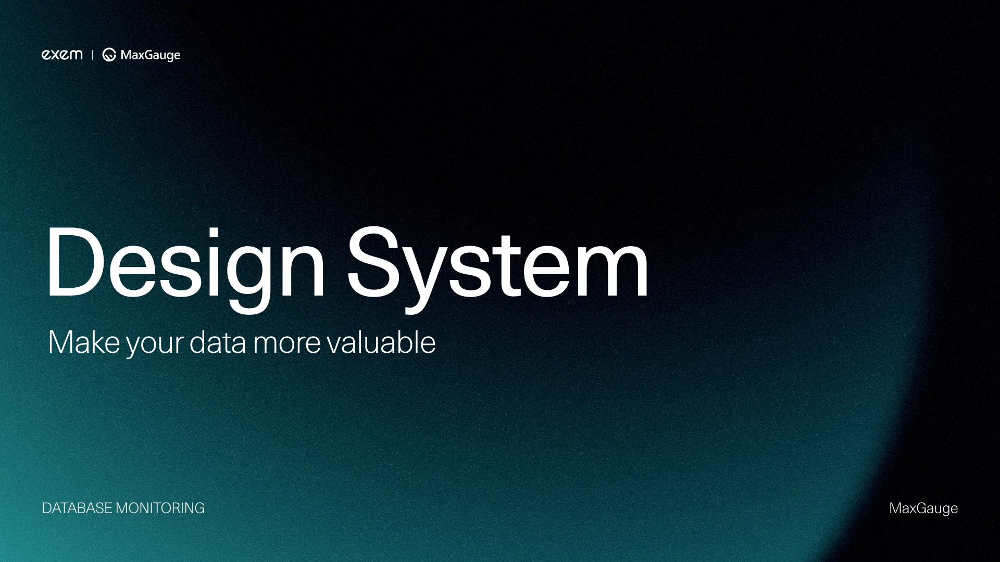
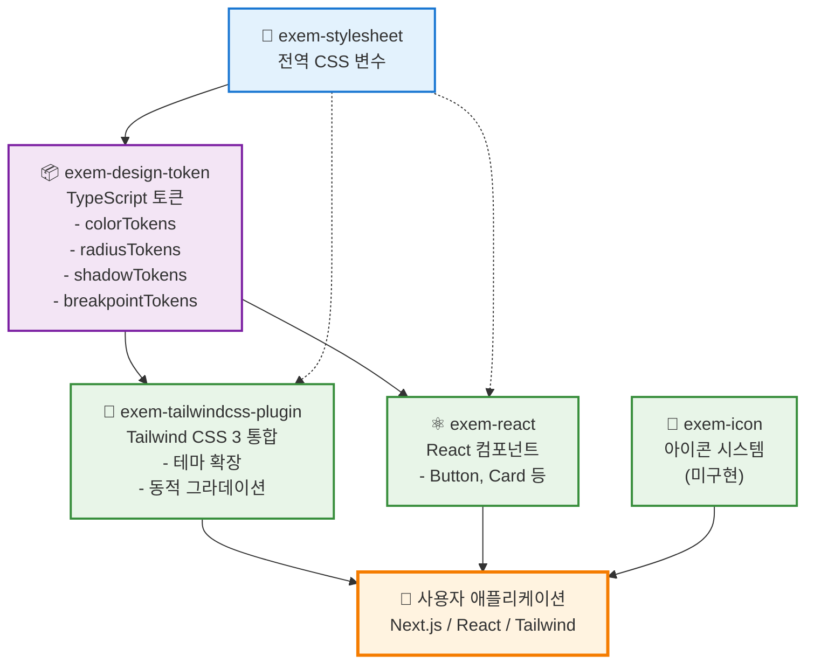

# EXEM Design System

> 🚧 **실험적 개발 단계**: 현재 모노레포 구조 및 디자인 토큰 시스템을 실험 중입니다.

EXEM 제품군을 위한 통합 디자인 시스템 (개발 중)

## 기술 스택

### 핵심 기술
- **모노레포**: pnpm workspace
- **빌드**: tsup
- **언어**: TypeScript
- **스타일**: CSS + PostCSS
- **버전 관리**: Changesets
- **테스트**: Vitest

### 코드 품질 & 자동화
- **린팅/포맷팅**: Biome (ESLint + Prettier 대체)
- **타입 체크**: TypeScript strict mode
- **커밋 검증**: Commitlint + Conventional Commits
- **Pre-commit Hook**: Husky (자동 포맷팅, 린팅, 타입 체크)
- **CI/CD**: GitHub Actions (품질 검사, 자동 릴리스) 

## 패키지 개발 상태

| 패키지 | 설명 | 상태 | v1.0 목표 | 배포 계획 |
|--------|------|------|-----------|-----------|
| [exem-stylesheet](./packages/stylesheet) | 전역 CSS 변수 및 스타일 | ✅ **완성** | ✅ 포함 | v1.0.0 |
| [exem-design-token](./packages/design-token) | CSS 변수 기반 TypeScript 디자인 토큰 | ✅ **완성** | ✅ 포함 | v1.0.0 |
| [exem-tailwindcss-plugin](./packages/tailwindcss3-plugin) | Tailwind CSS 3 통합 플러그인 | ✅ **완성** | ✅ 포함 | v1.0.0 |
| [exem-react](./packages/react) | React UI 컴포넌트 (Button only) | 🔨 **개발 중** | ✅ 포함 | v1.0.0 |
| [exem-icon](./packages/icon) | SVG 아이콘 컴포넌트 | 🚧 **미구현** | ⏭️ v1.x | v1.1.0+ |
| [@exem/docs](./packages/docs) | 문서 사이트 (Astro) | 🔨 **개발 중** | ✅ 포함 | v1.0.0 |

> 💡 **v1.0 릴리스 기준**: Button 컴포넌트 완성 + 전체 모노레포 인프라 안정화  
> 📊 **코드 품질**: Biome 린팅 + TypeScript strict mode + 테스트 커버리지  
> 🔒 **커밋 규칙**: Conventional Commits + Husky pre-commit hooks  
> 🎯 **전략**: Radix UI 기반 headless 패턴 활용 (자체 구현 X)

### 🎯 개발 로드맵

#### 🚧 v1.0 릴리스 목표 (GitHub 공개 전)

**필수 완료 항목:**
1. **✅ Button 컴포넌트 완성**
   - Radix UI 기반 구현
   - 모든 variant, size, state 완성
   - 접근성(a11y) 검증 완료
   - Storybook 문서화

2. **✅ 모노레포 인프라 완성**
   - 모든 패키지 빌드 성공
   - CI/CD 파이프라인 안정화
   - 버전 관리 시스템 (Changesets)
   - 커밋 규칙 자동화 (Commitlint + Husky)

3. **✅ 문서화**
   - README 완성 (설치, 사용법, 기여 가이드)
   - 패키지별 README
   - 라이선스 및 기여자 정보

4. **✅ 코드 품질**
   - TypeScript strict mode 통과
   - Biome 린팅 규칙 준수
   - 테스트 커버리지 확보

**v1.0 릴리스 시점:**
- 위 4가지 항목 모두 완료
- 1-2주 내부 테스트 완료
- GitHub 공개 및 첫 NPM 배포

#### 📦 v1.x - GitHub 공개 후 (점진적 확장)

**우선순위 높음:**
5. **Input 컴포넌트**
   - Radix UI 기반
   - TextField, TextArea, Number 등

6. **Select 컴포넌트**
   - Radix Select 기반
   - 단일/다중 선택

7. **Modal/Dialog 컴포넌트**
   - Radix Dialog 기반
   - Alert, Confirm 변형

**우선순위 중간:**
8. **Form 관련**
   - Checkbox, Radio, Switch (Radix 기반)
   - Form validation 통합

9. **피드백 컴포넌트**
   - Toast, Alert, Badge

10. **Icon 시스템**
    - SVG 아이콘 패키지
    - EXEM 제품군 공통 아이콘

#### 🔮 v2.x - 생태계 확장

**조건부 도입:**
11. **멀티 테마 시스템** (3개 이상 제품에서 필요 시)
    ```
    packages/preset-maxgauge/
    packages/preset-intermax/
    ```

12. **Ecosystem 패키지** (제품별 특화 요구사항 발생 시)
    ```
    packages/ecosystem/maxgauge/
    packages/ecosystem/intermax/
    ```

13. **프레임워크 확장** (수요 검증 후)
    - Vue, Svelte 지원
    - Next.js, Remix 최적화

### 💡 핵심 전략

**현재 집중 (v1.0까지):**
1. ✅ **Button 하나를 완벽하게** - 품질 기준 확립
2. ✅ **Radix UI 활용** - Headless UI는 직접 만들지 않음
3. ✅ **모노레포 안정화** - 빌드, CI/CD, 버전 관리

**v1.0 이후 (GitHub 공개 후):**
- 커뮤니티 피드백 수집
- 컴포넌트 점진적 추가 (Input → Select → Modal 순)
- 실제 EXEM 제품에 적용하며 검증

**장기적으로 고려:**
- 멀티 브랜드 시스템 (실제 필요 시)
- Figma 자동화 (디자인 팀 규모 커질 때)
- 다른 프레임워크 지원 (수요 발생 시)

**핵심 원칙:**
- ✅ 품질 > 속도 (하나를 제대로)
- ✅ Radix UI 재사용 (바퀴 재발명 금지)
- ✅ 점진적 확장 (필요할 때만 추가)
- ✅ 실제 사용 기반 검증 (추측 금지)

## 패키지 의존성 구조



### 의존성 설명

- **실선**: 직접 의존성 (package.json dependencies)
- **점선**: 간접 의존성 (CSS 변수 자동 로드)

#### 핵심 의존성 체인
1. `exem-stylesheet` → `exem-design-token` → 다른 모든 패키지
2. 모든 패키지는 궁극적으로 CSS 변수를 기반으로 동작
3. 토큰 변경 시 자동으로 모든 패키지에 반영

## 🚧 v1.0 릴리스 체크리스트

### ✅ 완료된 것
- [x] 모노레포 구조 (pnpm workspace)
- [x] 빌드 시스템 (tsup)
- [x] 디자인 토큰 시스템 (CSS 변수 → TypeScript)
- [x] Tailwind CSS 플러그인
- [x] CI/CD 파이프라인 (GitHub Actions)
- [x] 코드 품질 도구 (Biome, TypeScript strict)
- [x] 커밋 규칙 자동화 (Commitlint + Husky)
- [x] 버전 관리 (Changesets)

### 🔨 진행 중 (v1.0 전 완료 필요)
- [ ] **Button 컴포넌트** - Radix UI 기반, 모든 variant/size 완성
- [ ] **Storybook 문서화** - Button 컴포넌트 스토리 완성
- [ ] **테스트** - Button 컴포넌트 단위 테스트
- [ ] **문서 사이트** - 설치 가이드, API 레퍼런스
- [ ] **패키지 README** - 각 패키지별 사용법 문서화
- [ ] **내부 테스트** - 실제 EXEM 프로젝트에 적용 검증

### 🎯 v1.0 릴리스 후
- [ ] **GitHub 공개** - 저장소 public 전환
- [ ] **NPM 배포** - @exem/* 패키지 퍼블리시
- [ ] **커뮤니티** - 이슈/PR 템플릿, CONTRIBUTING.md
- [ ] **Input 컴포넌트** - v1.1.0 목표
- [ ] **Select 컴포넌트** - v1.2.0 목표
- [ ] **Modal 컴포넌트** - v1.3.0 목표

## 로컬 개발 시작

```bash
# 저장소 클론
git clone <repository-url>
cd exem-design

# 의존성 설치
pnpm install

# 개발 모드 (전체 패키지 빌드 감시)
pnpm dev

# 디자인 토큰 재생성 (CSS 변수 수정 시)
cd packages/design-token && pnpm generate
```

### 💡 개발 팁

- **CSS 변수 수정**: `packages/stylesheet/src/global.css` 편집
- **토큰 자동 생성**: CSS 변경 시 pre-commit hook이 자동으로 토큰 재생성
- **커밋 메시지**: `type(scope): subject` 형식 준수 (자동 검증)
- **코드 품질**: 커밋 전 자동으로 포맷팅, 린팅, 타입 체크 실행
- **실제 사용**: 현재 워크스페이스 내에서만 가능 (NPM 미배포 상태)

## 🚀 시작하기 - 전체 프로세스 (A to Z)

### A. 프로젝트 초기 설정

```bash
# a. 저장소 클론
git clone <repository-url>

# b. 프로젝트 디렉토리 이동
cd exem-design

# c. Node.js 버전 확인 (16.x 이상 권장)
node --version
```

### B. 의존성 설치

```bash
# d. pnpm 설치 (없는 경우)
npm install -g pnpm

# e. 프로젝트 의존성 설치
pnpm install

# f. Husky hooks 설정 (자동으로 실행됨)
# - Pre-commit hook 활성화
# - Commit message 검증 설정
```

### C. 개발 환경 시작

```bash
# g. 전체 패키지 빌드 (최초 1회)
pnpm build

# h. 개발 모드 시작 (파일 변경 감시)
pnpm dev

# i. 문서 사이트 실행 (선택사항)
cd packages/docs && pnpm dev
```

### D. 코드 작성 및 수정

```bash
# j. CSS 변수 수정
# 파일: packages/stylesheet/src/global.css

# k. 디자인 토큰 재생성
cd packages/design-token && pnpm generate

# l. React 컴포넌트 개발
# 파일: packages/react/src/*.tsx
```

### E. 코드 품질 검사

```bash
# m. 코드 포맷팅 확인
pnpm format

# n. 린팅 검사
pnpm lint

# o. 린팅 자동 수정
pnpm lint:fix

# p. TypeScript 타입 체크
pnpm typecheck

# q. 테스트 실행
pnpm test
```

### F. Git 커밋 프로세스

```bash
# r. 변경사항 확인
git status

# s. 파일 스테이징
git add .

# t. 커밋 (Conventional Commits 형식 준수)
git commit -m "feat(react): add new component"
# Pre-commit hook이 자동으로 실행됨:
# 1. 토큰 재생성 (CSS 변경 시)
# 2. 코드 포맷팅
# 3. 린팅 자동 수정
# 4. 타입 체크
```

### G. 버전 관리 및 변경 로그

```bash
# u. 변경사항 기록 (Changesets)
pnpm changeset
# - 변경된 패키지 선택
# - 버전 타입 선택 (major/minor/patch)
# - 변경사항 설명 작성

# v. 버전 업데이트 및 CHANGELOG 생성
pnpm version
# - package.json 버전 자동 업데이트
# - CHANGELOG.md 자동 생성

# w. 버전 커밋 및 푸시
git add .
git commit -m "chore: release new version"
git push
```

### H. 빌드 및 배포

```bash
# x. 프로덕션 빌드
pnpm build

# y. 의존성 버전 업데이트 (배포 전)
pnpm deps:update
# workspace:* → 실제 버전으로 변경

# z. NPM 배포
pnpm release
# - 전체 패키지 빌드
# - NPM 레지스트리에 배포

# z+1. 의존성 복구 (배포 후)
pnpm deps:revert
# 실제 버전 → workspace:*로 복구
```

### I. 문제 해결

```bash
# 캐시 정리
pnpm clean           # 빌드 결과물 삭제
rm -rf node_modules  # node_modules 삭제
pnpm install         # 재설치

# 빌드 강제 재실행
pnpm build --force

# 특정 패키지만 빌드
cd packages/react && pnpm build
```

## 명령어 레퍼런스

```bash
# 개발
pnpm dev           # 전체 패키지 빌드 감시 모드
pnpm build         # 전체 패키지 빌드
pnpm clean         # 빌드 결과물 정리

# 코드 품질
pnpm lint          # Biome 코드 검사
pnpm lint:fix      # Biome 코드 자동 수정
pnpm format        # Biome 코드 포맷팅
pnpm typecheck     # TypeScript 타입 체크
pnpm test          # Vitest 테스트 실행

# 버전 관리
pnpm changeset     # 변경사항 기록 (대화형)
pnpm version       # 버전 업데이트 및 CHANGELOG 자동 생성
pnpm release       # 빌드 후 npm 배포

# 의존성 관리
pnpm deps:update   # workspace:*를 실제 버전으로 변경 (배포용)
pnpm deps:revert   # 실제 버전을 workspace:*로 복구 (개발용)
```

## 🛠️ 개발 환경 구성

### Biome - 통합 린팅/포맷팅

- **ESLint + Prettier 대체**: 단일 도구로 통합
- **성능**: Rust 기반으로 10-20배 빠른 속도
- **설정**: `biome.json`에서 프로젝트 규칙 관리
- **주요 규칙**:
  - `useBlockStatements: error` - 조건문 중괄호 필수
  - `noConsole: warn` - console 사용 경고 (scripts 제외)
  - `useExhaustiveDependencies: warn` - React Hook 의존성 검사
  - `noExplicitAny: error` - any 타입 금지

### Husky - Pre-commit Hook

커밋 전 자동으로 다음 작업을 수행합니다:

1. **토큰 자동 생성**: `global.css` 변경 시 디자인 토큰 재생성
2. **코드 포맷팅**: Biome으로 자동 포맷팅
3. **린팅**: 코드 품질 문제 자동 수정
4. **타입 체크**: TypeScript 타입 오류 검사

```bash
# Pre-commit hook이 자동으로 실행하는 명령어들
1. pnpm format      # 포맷팅
2. pnpm lint:fix    # 린팅 자동 수정
3. pnpm typecheck   # 타입 체크
```

### Commitlint - 커밋 메시지 검증

**Conventional Commits** 규칙을 강제합니다:

```bash
# 올바른 커밋 메시지 형식
<type>(<scope>): <subject>

# 예시
feat(react): add Button component
fix(design-token): resolve type errors
docs(readme): update installation guide
chore(deps): update dependencies
```

**Type 목록**:
- `feat`: 새로운 기능
- `fix`: 버그 수정
- `docs`: 문서 변경
- `style`: 코드 스타일 (포맷팅)
- `refactor`: 리팩토링
- `test`: 테스트 추가/수정
- `chore`: 빌드, 설정 변경

**Scope 목록**:
- `react`, `design-token`, `stylesheet`, `tailwind`, `icon`, `docs`, `root`

### CI/CD - GitHub Actions

모든 Pull Request와 Main 브랜치에서 자동 실행:

**CI Pipeline** (`.github/workflows/ci.yml`):
- ✅ 의존성 설치 (pnpm)
- ✅ 코드 포맷팅 검사 (Biome)
- ✅ 린팅 검사 (Biome)
- ✅ 타입 체크 (TypeScript)
- ✅ 빌드 검증
- ✅ 테스트 실행 (Vitest)

**Release Pipeline** (`.github/workflows/release.yml`):
- 🚀 Changesets 기반 자동 버전 관리
- 📦 NPM 자동 배포
- 📝 CHANGELOG 자동 생성
- 🏷️ Git 태그 자동 생성