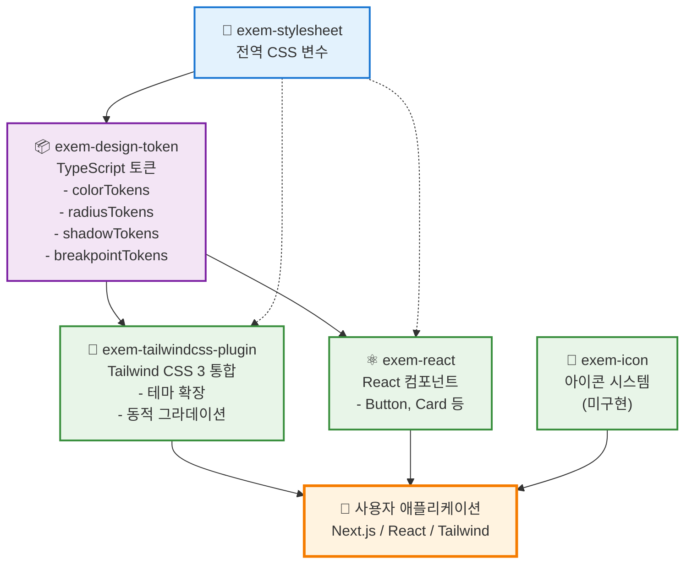

# EXEM Design System

> 🚧 **실험적 개발 단계**: 현재 모노레포 구조 및 디자인 토큰 시스템을 실험 중입니다.

EXEM 제품군을 위한 통합 디자인 시스템 (개발 중)

## 기술 스택

- **모노레포**: pnpm workspace
- **빌드**: tsup
- **언어**: TypeScript
- **스타일**: CSS + PostCSS
- **버전 관리**: changesets
- **테스트**: Vitest
- **린팅/포맷팅**: Biome 

## 패키지 개발 상태

| 패키지 | 설명 | 상태 | 빌드 | 배포 |
|--------|------|------|------|------|
| [exem-stylesheet](./packages/stylesheet) | 전역 CSS 변수 및 스타일 | ✅ **구현됨** | ✅ 성공 | 🚀 준비됨 |
| [exem-design-token](./packages/design-token) | CSS 변수 기반 TypeScript 디자인 토큰 | ✅ **구현됨** | ✅ 성공 | 🚀 준비됨 |
| [exem-tailwindcss-plugin](./packages/tailwindcss3-plugin) | Tailwind CSS 3 통합 플러그인 | ✅ **구현됨** | ✅ 성공 | 🚀 준비됨 |
| [exem-react](./packages/react) | React UI 컴포넌트 | 🔨 **초기 개발** | ✅ 성공 | 🚀 준비됨 |
| [exem-icon](./packages/icon) | SVG 아이콘 컴포넌트 | 🚧 **미구현** | ⏭️ 스킵 | ❌ 미준비 |
| [@exem/docs](./packages/docs) | 문서 사이트 (Astro) | 🔨 **개발 중** | ⏭️ 스킵 | ❌ 미준비 |

> 💡 **빌드 상태**: `pnpm build` 성공 (미구현 패키지는 자동 스킵)  
> 📊 **상세 보고서**: [BUILD_STATUS.md](./BUILD_STATUS.md) 참조

## 패키지 의존성 구조



### 의존성 설명

- **실선**: 직접 의존성 (package.json dependencies)
- **점선**: 간접 의존성 (CSS 변수 자동 로드)

#### 핵심 의존성 체인
1. `exem-stylesheet` → `exem-design-token` → 다른 모든 패키지
2. 모든 패키지는 궁극적으로 CSS 변수를 기반으로 동작
3. 토큰 변경 시 자동으로 모든 패키지에 반영

## 🚧 현재 사용 가능한 기능

### ✅ 구현된 기능들

**1. 디자인 토큰 시스템**:
```bash
# 워크스페이스에서 개발
pnpm dev

# 토큰 재생성
cd packages/design-token && pnpm generate
```

**2. CSS 변수 활용**:
```typescript
// 로컬 개발 시에만 사용 가능
import { tokens } from 'exem-design-token'

const style = {
  backgroundColor: tokens.color['surface-accent-default'],
  borderRadius: tokens.radius.medium
}
```

**3. Tailwind 플러그인** (실험적):
```javascript
// tailwind.config.js (로컬 개발용)
module.exports = {
  plugins: [require('./packages/tailwindcss3-plugin')]
}
```

### 🚧 개발 예정

- **React 컴포넌트**: Button, Input, Modal 등
- **아이콘 시스템**: SVG 아이콘 라이브러리  
- **NPM 배포**: 실제 패키지 설치 가능

## 로컬 개발 시작

```bash
# 저장소 클론
git clone <repository-url>
cd exem-design

# 의존성 설치
pnpm install

# 개발 모드 (전체 패키지 빌드 감시)
pnpm dev

# 디자인 토큰 재생성 (CSS 변수 수정 시)
cd packages/design-token && pnpm generate
```

### 💡 개발 팁

- CSS 변수 수정: `packages/stylesheet/src/global.css`
- 토큰 자동 생성: `pnpm generate`로 TypeScript 토큰 업데이트
- 실제 사용은 워크스페이스 내에서만 가능 (NPM 미배포 상태)

## 명령어

```bash
# 개발
pnpm dev           # 전체 패키지 빌드 감시 모드
pnpm build         # 전체 패키지 빌드
pnpm clean         # 빌드 결과물 정리

# 코드 품질
pnpm lint          # 코드 검사
pnpm lint:fix      # 코드 자동 수정
pnpm format        # 코드 포맷팅
pnpm typecheck     # 타입 체크
pnpm test          # 테스트 실행

# 버전 관리
pnpm changeset     # 변경사항 기록
pnpm version       # 버전 업데이트 및 CHANGELOG 생성
pnpm release       # 빌드 후 npm 배포
```