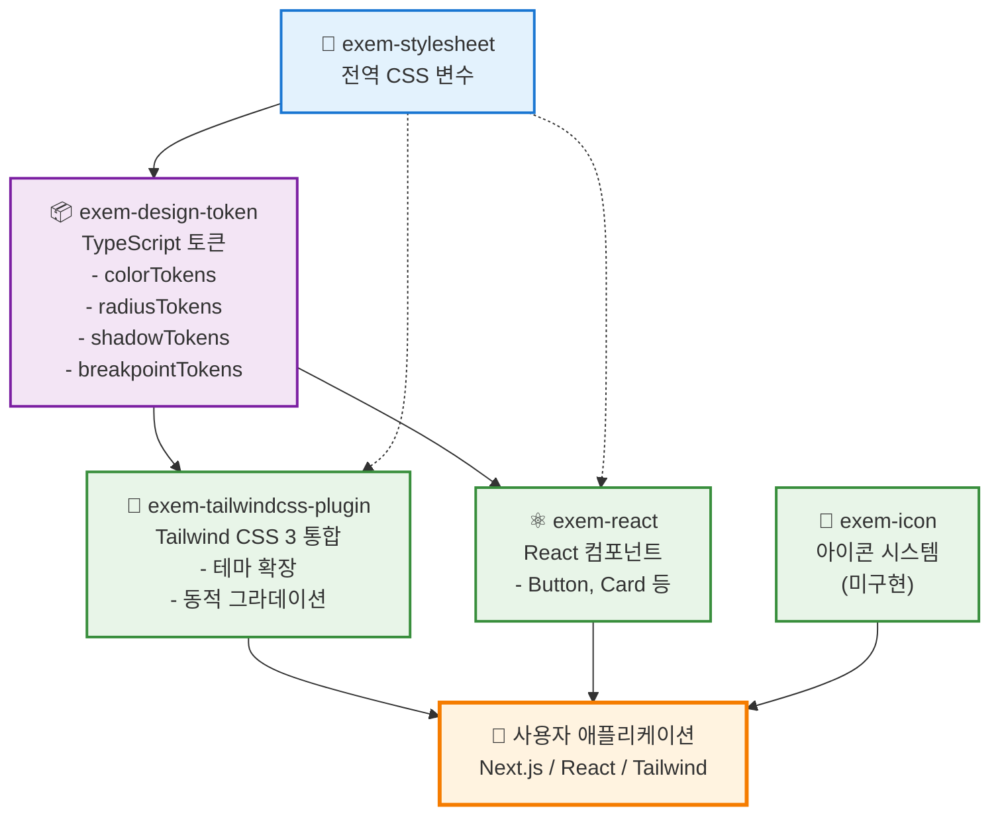

# EXEM Design System

EXEM 제품군을 위한 통합 디자인 시스템

## 기술 스택

- **모노레포**: pnpm workspace
- **빌드**: tsup
- **언어**: TypeScript
- **스타일**: CSS + PostCSS
- **버전 관리**: changesets
- **테스트**: Vitest
- **린팅/포맷팅**: Biome 

## 패키지

| 패키지 | 설명 | 버전 |
|--------|------|------|
| [exem-stylesheet](./packages/stylesheet) | 전역 CSS 변수 및 스타일 | 0.2.0 |
| [exem-design-token](./packages/design-token) | CSS 변수 기반 TypeScript 디자인 토큰 | 0.2.0 |
| [exem-tailwindcss-plugin](./packages/tailwindcss3-plugin) | Tailwind CSS 3 통합 플러그인 | 0.1.0 |
| [exem-icon](./packages/icon) | SVG 아이콘 컴포넌트 (미구현) | 0.1.0 |
| [exem-react](./packages/react) | React UI 컴포넌트 | 0.1.0 |

## 패키지 의존성 구조



### 의존성 설명

- **실선**: 직접 의존성 (package.json dependencies)
- **점선**: 간접 의존성 (CSS 변수 자동 로드)

#### 핵심 의존성 체인
1. `exem-stylesheet` → `exem-design-token` → 다른 모든 패키지
2. 모든 패키지는 궁극적으로 CSS 변수를 기반으로 동작
3. 토큰 변경 시 자동으로 모든 패키지에 반영

## 사용 사례별 워크플로우

### 🎨 Tailwind CSS 사용자
```bash
# 1. 플러그인 설치
pnpm add exem-tailwindcss-plugin

# 2. tailwind.config.js 설정
module.exports = {
  plugins: [require('exem-tailwindcss-plugin')]
}

# 3. 컴포넌트에서 사용
<div className="bg-surface-primary-default text-text-primary rounded-medium">
  <h1 className="text-header-1">EXEM 제목</h1>
  <div className="bg-gradient-exem-logo-[to_right]">그라데이션</div>
</div>
```

### ⚛️ React 컴포넌트 사용자
```bash
# 1. 컴포넌트 설치
pnpm add exem-react

# 2. 애플리케이션에서 사용
import { Button, Card } from 'exem-react'

<Card>
  <Button variant="primary">EXEM 버튼</Button>
</Card>
```

### 🎯 토큰만 사용하는 사용자
```bash
# 1. 토큰 패키지 설치
pnpm add exem-design-token

# 2. CSS-in-JS에서 사용
import { color, radius, shadow } from 'exem-design-token'

const StyledButton = styled.button`
  background: ${color['surface-accent-default']};
  border-radius: ${radius.medium};
  box-shadow: ${shadow.weak};
`
```

## 빠른 시작

```bash
# 의존성 설치
pnpm install

# 전체 패키지 빌드
pnpm build

# 패키지 빌드 감시 모드 (개발용)
pnpm dev

# 디자인 토큰 재생성 (필요시)
cd packages/design-token && pnpm generate
```

## 명령어

```bash
# 개발
pnpm dev           # 전체 패키지 빌드 감시 모드
pnpm build         # 전체 패키지 빌드
pnpm clean         # 빌드 결과물 정리

# 코드 품질
pnpm lint          # 코드 검사
pnpm lint:fix      # 코드 자동 수정
pnpm format        # 코드 포맷팅
pnpm typecheck     # 타입 체크
pnpm test          # 테스트 실행

# 버전 관리
pnpm changeset     # 변경사항 기록
pnpm version       # 버전 업데이트 및 CHANGELOG 생성
pnpm release       # 빌드 후 npm 배포
```