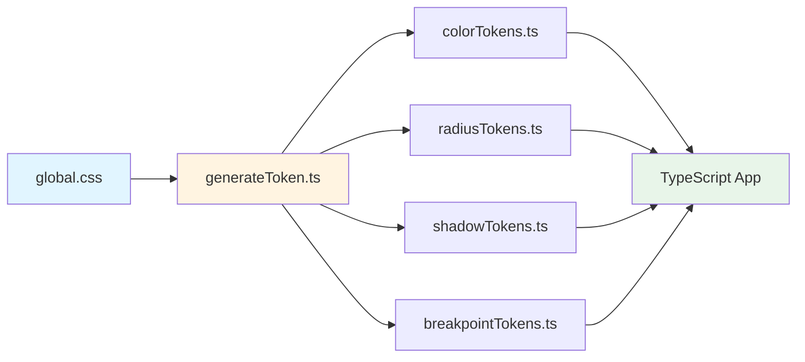

# @exem-fe/design-token

[](https://www.npmjs.com/package/@exem-fe/design-token)
[](https://www.npmjs.com/package/@exem-fe/design-token)

EXEM 디자인 시스템의 디자인 토큰 - TypeScript에서 type-safe하게 사용 가능한 디자인 토큰

## 개요

CSS 변수를 기반으로 TypeScript 토큰을 자동 생성합니다. CSS-in-JS 라이브러리나 TypeScript 프로젝트에서 타입 안전성을 보장합니다.

### 토큰 생성 흐름



## 주요 기능

| 기능 | 설명 |
|------|------|
| **자동 생성** | CSS 변수에서 TypeScript 토큰 자동 추출 |
| **타입 안전성** | 컴파일 타임 오타 방지 |
| **CSS 변수** | `var(--token-name)` 형태로 활용 |
| **카테고리 분류** | color, radius, shadow, breakpoint |

## 설치

```bash
pnpm add @exem-fe/design-token
# or
npm install @exem-fe/design-token
# or
yarn add @exem-fe/design-token
```

## 사용법

### 기본 사용

```typescript
import { tokens } from '@exem-fe/design-token';

// CSS 변수 문자열 반환
const primaryColor = tokens.color['text-primary'];
// → "var(--color-text-primary)"

const borderRadius = tokens.radius.medium;
// → "var(--radius-medium)"
```

### 타입 안전성

```typescript
import type { colorTokenKeys } from '@exem-fe/design-token';

// 자동완성 지원
function applyColor(key: colorTokenKeys) {
  return tokens.color[key];
}

applyColor('text-primary'); // ✅ 정상
applyColor('invalid-key');  // ❌ 타입 오류
```

### CSS 변수 직접 사용

```typescript
import '@exem-fe/design-token/css';

// CSS 변수가 전역으로 로드됨
// → --color-text-primary
// → --radius-medium
// → --shadow-weak
```

## 토큰 카테고리

| 카테고리 | 토큰 수 | 용도 |
|----------|---------|------|
| **color** | 300+ | 색상, 텍스트, 배경, 테두리 |
| **radius** | 4 | 테두리 반경 (weak, medium, strong, circle) |
| **shadow** | 4 | 그림자 (preview, weak, medium, strong) |
| **breakpoint** | 3 | 반응형 (md, lg, xl) |

## 빌드 스크립트

토큰 자동 생성:

```bash
pnpm generate
```

CSS 변수 변경 시 자동으로 TypeScript 토큰이 재생성됩니다.

## 라이선스

Apache-2.0
