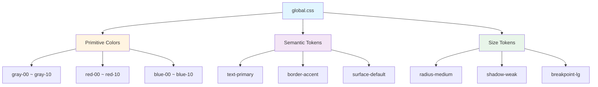

# @exem-fe/stylesheet

[](https://www.npmjs.com/package/@exem-fe/stylesheet)
[](https://www.npmjs.com/package/@exem-fe/stylesheet)

EXEM 디자인 시스템의 CSS 변수와 전역 스타일

## 개요

모든 CSS 변수(color, radius, shadow, breakpoint)를 포함한 전역 스타일을 제공합니다.

### CSS 변수 계층 구조



## 주요 기능

| 기능 | 설명 |
|------|------|
| **전역 CSS 변수** | 색상, 반경, 그림자, 브레이크포인트 |
| **Primitive 색상** | gray, red, blue, green 등 전체 팔레트 |
| **Semantic 색상** | 텍스트, 테두리, 아이콘, 서피스 |
| **즉시 사용** | CSS 변수로 바로 활용 |

## 설치

```bash
pnpm add @exem-fe/stylesheet
# or
npm install @exem-fe/stylesheet
# or
yarn add @exem-fe/stylesheet
```

## 사용법

### CSS/SCSS

```css
@import '@exem-fe/stylesheet';

.button {
  background: var(--color-surface-primary-default);
  border-radius: var(--radius-medium);
  box-shadow: var(--shadow-weak);
}
```

### React/Next.js

```tsx
// App.tsx
import '@exem-fe/stylesheet';
```

### Vanilla JS

```html
<link rel="stylesheet" href="node_modules/@exem-fe/stylesheet/dist/index.css" />
```

## 포함된 CSS 변수

### 색상 (300+)
- Primitive: `--color-gray-00` ~ `--color-pink-10`
- Text: `--color-text-primary`, `--color-text-secondary`
- Border: `--color-border-primary`, `--color-border-accent`
- Icon: `--color-icon-primary`, `--color-icon-disabled`
- Surface: `--color-surface-primary-default`

### 크기
- Radius: `--radius-weak`, `--radius-medium`, `--radius-strong`
- Shadow: `--shadow-weak`, `--shadow-medium`, `--shadow-strong`
- Breakpoint: `--breakpoint-md`, `--breakpoint-lg`

## 다른 패키지와 함께 사용

```bash
# TypeScript 토큰
pnpm add @exem-fe/design-token
# or npm install / yarn add

# Tailwind 플러그인
pnpm add -D @exem-fe/tailwindcss-plugin
# or npm install -D / yarn add -D
```

## 라이선스

Apache-2.0
